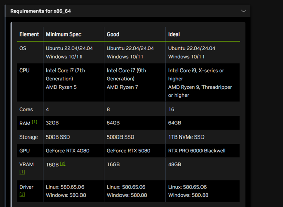
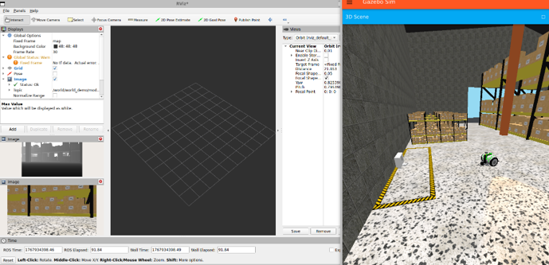
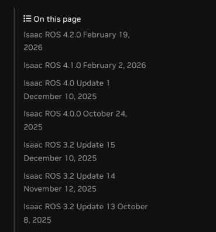

# Evaluation
As the final part of our documentation, we evaluate our own work. We discuss limitations, dead ends, and areas that could be improved.

## PSE Project Structure
A PSE project is typically split into five phases:

1. Pflichtenheft: Creating a 30-page document that defines software requirements without going into implementation.
2. Design: Creating a 100-page document, mainly with UML and class diagrams (object-oriented focus).
3. Implementation: In this phase, the actual project code is written.
4. Quality Assurance: A 10-20 page document that describes implemented tests.
5. Final Presentation: A final presentation that provides an overview of the project.

For more details, refer to the [PSE Guide](https://sdq.kastel.kit.edu/wiki/Praxis_der_Software-Entwicklung/Tipps_und_Tricks) (as of 30.03.2026).

Our project did not fully follow this structure and mainly consisted of these parts:

1. Pflichtenheft: We created this document because high-level software requirements still made sense for our project.
2. Implementation: We skipped the design phase because the project is not object-oriented. It mainly consists of Bash scripts, a Python launch file, and one DINO/SAM node. We did not want to force OOP onto a workflow that mainly connects existing models in a ROS environment. We were also unsure which models would be used in the final implementation until compatibility testing was complete.
3. Final Presentation: Since we did not have unit tests (which are not a natural fit for this specific project type), we did not create a separate QA document.

## Changes we made during Implementation
During implementation, we had multiple situations where we switched to a different approach instead of trying to force one specific model or system to work.

Models we considered:

- VSLAM: This NVIDIA package calculates odometry based on visual data. During implementation, we had many TF data issues and hoped VSLAM would solve them. However, it was difficult to run VSLAM reliably at our low frame rates. The package became unnecessary once we established a coherent TF tree.
- YOLOv8: This alternative to DINO works without prompts, but only with a predefined list of objects (which cannot be changed), so we did not use it. DINO currently works well with [semantic_classes.yaml](src/my_dino_package/config/semantic_classes.yaml).
- SAM2: We considered implementing SAM2 after getting SAM1 running. This turned out to be more time-consuming than expected and did not work in our setup. We believe this is because SAM2 is video-oriented and does not handle our low frame rates well.

## Robot simulation
Originally, we planned to use Isaac Sim as our robot simulation environment. This was not feasible with the hardware we had available. NVIDIA recommends an "ideal machine" for nvblox usage.

This was far beyond our available hardware, so we switched to Gazebo as a more lightweight alternative.

Using Gazebo with DINO/SAM was not ideal, because the non-photorealistic environment reduced segmentation accuracy. For testing purposes, however, it was good enough, and obvious objects were still detected reliably.

## Version Issues
NVIDIA frequently updates the Docker environment we use.

This caused one specific issue during development: we had to rewrite parts of the installation guide because commands stopped working after NVIDIA invalidated old links without notice. We also had to explicitly fix a missing pip dependency after it was removed from the pipeline.

## How could this Project be improved?
If you are reading this later (current date: 30.03.2026), you may have access to more powerful hardware. We recommend trying to run the nvblox node and the DINO node in parallel. We could not get this to work due to hardware limitations and did not want to keep untested functionality in the project, but you can try adjusting the launch file to start the DINO/SAM node alongside nvblox.

You could also try integrating SAM3 (Currently there is no ROS integration but that will probably change at a later date). The newest model provided by Meta will likely improve segmentation quality significantly.

