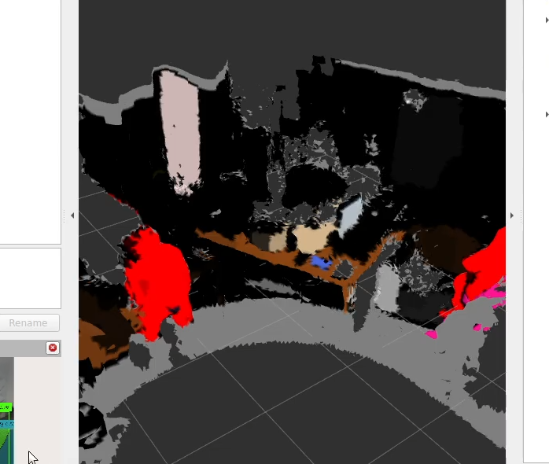
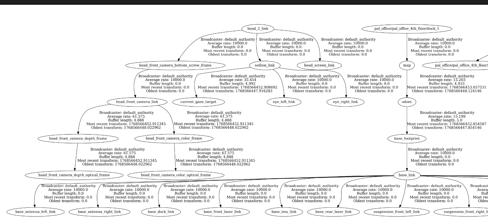

# Mesh Generation Using nvblox

In this section of the documentation, we cover the specifics of mesh generation — specifically, the use of a library called **nvblox** to create a 3D mesh environment from RGBD and LiDAR ROS 2 data streams. The following picture shows an example of what such a mesh could look like.



---

## Configuration

In the [nvblox_params.yaml](src/my_dino_package/config/nvblox_params.yaml) you'll find the parameters we pass to nvblox to generate the mesh. For more detailed information, please refer to the official [documentation](https://nvidia-isaac-ros.github.io/repositories_and_packages/isaac_ros_nvblox/isaac_ros_nvblox/api/parameters.html).

### General Settings

- **`voxel_size`** — Refers to the detail of the mesh. The lower the voxel size, the higher the density and thus the higher the detail. We've found that the current setting of `0.03` works quite well with 8 GB of VRAM. With 16 GB, `0.015` worked fine, but this may vary depending on your specific setup. If your mesh density is too high, you may encounter an error stating that you've run out of memory. This means your GPU is running out of VRAM — if that happens, lower the mesh density and restart the container to free any allocated VRAM.

- **`use_tf_transforms`** — Must be set to `true`, as the TF data is needed by nvblox to generate a mesh.

- **`use_sim_time`** — Normally used to sync to the `/clock` topic. Since our preprocessing script records with simulation time (the segmentation sometimes lags, and we've found it more stable that way), this should be set to `true`.

- **`mapping_type`** — We are using the `static_tsdf` type, which is suitable for static indoor environments. This is the standard setting provided by NVIDIA.

### Performance Tuning

The performance tuning parameters define the frequency at which data is processed. The current settings we've provided work quite well with a GPU that has 8 GB+ of VRAM.

### TSDF Integrator

- **`tsdf_integrator_max_integration_distance_m`** — The maximum distance in meters to integrate depth and color values.
- **`tsdf_integrator_truncation_distance_vox`** — The truncation distance in units of voxels. We are using the default value.

### Mesh Integrator

- **`mesh_integrator_min_weight`** — The minimum weight of a voxel to be included in the mesh. The current setting of `0.5` reduces noise.
- **`mesh_integrator_weld_vertices`** — Welds together identical vertices in the mesh, resulting in a more stable-looking output.

### ESDF Settings

The ESDF settings are used to ignore obstacles below or above a certain height.

### Inputs

- **`use_depth`**, **`use_color`**, and **`use_lidar`** — Define whether depth, RGB, and point cloud data is considered in mesh generation.
- **`use_lidar_motion_compensation`** — Defines whether to use motion compensation for LiDAR scan integration. This setting was added in version 4.1. With the TIAGo Pro, we've found no real benefit in using it, so we've turned it off by default.

### Map Clearing

- **`map_clearing_radius_m`** — This setting cleans up mesh data too distant from the `map_clearing_frame_id`. Since that's not intended for our project, we used `-1`.

### Frames

- **`global_frame`** — Refers to the global frame in the TF tree. The TIAGo Pro calls it `map`.
- **`pose_frame`** — Refers to the entry point of the transformation tree. Sensor data should be below this point. The TIAGo Pro uses `base_footprint`.

### Map Decay

The map decay settings are only used to disable the decaying of the mesh, as the mesh would normally decay after some time. Since that's not intended for our project, we've set them to `0`.

---

## Proper TF Data

TF data is needed to properly calculate the mapping, as the positions of the RGBD camera and the LiDAR have to be taken into account for a proportionally correct mapping.

The TF tree of your ROS 2 data stream can be viewed with the following command:

```bash
ros2 run tf2_tools view_frames
```

This command will generate a PDF displaying your TF tree. The TF tree from this [rosbag](https://bwsyncandshare.kit.edu/s/bMHRyJ6gQBnz9yP?dir=/https://bwsyncandshare.kit.edu/s/bMHRyJ6gQBnz9yP) (we are using the `my_rosbag_20260202_185940` bag) can be seen in this [PDF](images/frames_2026-03-06_11.06.52.pdf). It is of high importance that all of your sensor-related TF nodes are descendant nodes of the `pose_frame` node. Otherwise, nvblox will not generate a mesh.

### Example: Bad TF Tree



You can clearly see that `head_2_link` is not connected to the base link. If your TF tree looks like this, we'd recommend a new setup of your robot and a new recording.

If that's not possible, you can apply a static TF to manually fix the TF tree. You can do this by adding something like the following to the `generate_launch_description()` function:

```python
torso_base_to_lift = Node(
        package='tf2_ros',
        executable='static_transform_publisher',
        name='torso_base_to_lift',
        arguments=[
            '--frame-id', 'torso_base_link',
            '--child-frame-id', 'head_2_link',
            '--x', '0', '--y', '0', '--z', '0',
            '--qx', '0', '--qy', '0', '--qz', '0', '--qw', '1',
            '--ros-args', '-p', 'use_sim_time:=true'
        ],
        output='screen'
    )
```

You'd also have to add `torso_base_to_lift` in the return value. This should manually create a connection between `torso_base_link` and `head_2_link`, but since the offsets can only be estimated by you, we strongly recommend recording a new rosbag instead.

---

## Adjusting the Launch File to Your Needs

The launch file [tiagoProNvblox.launch.py](src/my_dino_package/launch/tiagoProNvblox.launch.py) launches the nvblox part of the pipeline. If you are using a different robot, you'll have to adjust the topic names in the nvblox container:

```python
nvblox_container = ComposableNodeContainer(
        name='nvblox_container',
        namespace='',
        package='rclcpp_components',
        executable='component_container_mt',
        composable_node_descriptions=[
            ComposableNode(
                package='nvblox_ros',
                plugin='nvblox::NvbloxNode',
                name='nvblox_node',
                parameters=[
                    nvblox_config,
                ],
                remappings=[
                    ('camera_0/depth/image', '/head_front_camera/depth/image_rect_raw'),
                    ('camera_0/depth/camera_info', '/head_front_camera/depth/camera_info'),
                    ('camera_0/color/image', '/semantic/image_rgb8'),
                    ('camera_0/color/camera_info', '/semantic/camera_info'),
                    ('pointcloud', '/merged_cloud'),
                ]
            ),
        ],
        output='screen'
    )
```

- `/head_front_camera/depth/image_rect_raw` (and camera info) should be your **depth** data.
- `/semantic/image_rgb8` (and camera info) should stay as-is we use the segmented masks produced by DINO/SAM as RGB values in order to create a semantically segmented mesh.
- `/merged_cloud` should be your **LiDAR** data.

We are remapping the topics to `camera_0/depth/image`, etc., since these are the input topics that nvblox reads from.

### Launching

The file can be launched using:

```bash
ros2 launch my_dino_package tiagoProNvblox.launch.py \
  bag_path:=/workspaces/isaac_ros-dev/bags/tugbot_semantic_bag_test/ \
  rate:=1 \
  output_mesh:=/workspaces/isaac_ros-dev/meshes/semantic_tiago_mesh.glb
```
Before running the pipeline, build the package and install the required dependencies (pip and trimesh used to be included in the container, but recent updates require a manual installation):

```bash
colcon build --packages-select my_dino_package && source install/setup.bash
sudo apt-get install -y python3-pip
pip install trimesh --break-system-packages
```

Adjust the paths to your needs. The `rate` parameter can be used to speed up the playback of the bag — high speeds may cause nvblox to be unable to keep up.

The other files like [setup.py](src/my_dino_package/setup.py) and [package.xml](src/my_dino_package/package.xml) are basic files needed in a ROS 2 package. If you are unfamiliar with ROS 2 packages, please refer to the [official documentation](https://docs.ros.org/en/jazzy/How-To-Guides/Developing-a-ROS-2-Package.html).

---

## Visualizing the Mesh in RViz

The mesh generation can be viewed in real time using **RViz**. To do this:

1. **Open RViz** in a separate terminal (inside the Docker container):
   ```bash
   rviz2
   ```

2. **Add the nvblox mesh display:**
   - In RViz, click **Add** (bottom-left panel).
   - Go to the **By topic** tab.
   - Find and select `/nvblox_node/mesh` → `NvbloxMesh`.
   - Click **OK**.

3. **Set the correct fixed frame:**
   - In the **Global Options** section (left panel, top), set **Fixed Frame** to `map` (or whatever your `global_frame` is set to in the config).

> **Tip:** If you don't see a mesh building up, check the terminal output for errors. Common issues include missing TF data or mismatched topic names. You can also verify that data is flowing with `ros2 topic hz /nvblox_node/mesh_marker`.

For visualization in Unity, please refer to the Unity section in the [README.md](README.md).

---

## Why Are We Using GLB?

Since one of the project's goals was to import the mesh into Unity, we found that **trimesh** nicely converts `.ply` files (the format normally output by nvblox) into `.glb` files. With [GLTFUtility](https://github.com/Siccity/GLTFUtility), it's straightforward to import `.glb` files into Unity. Directly importing `.ply` files into Unity proved to be difficult, which is why we added the conversion step.