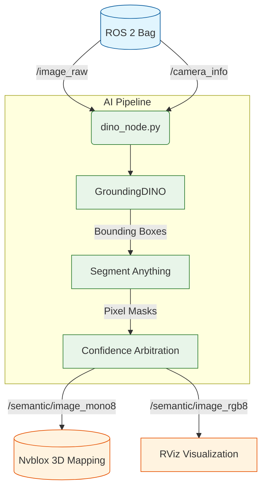
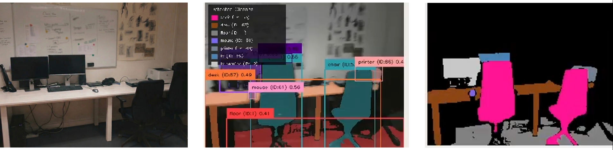
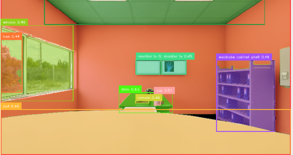
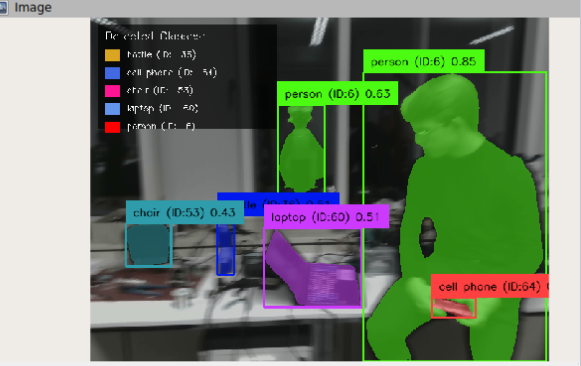
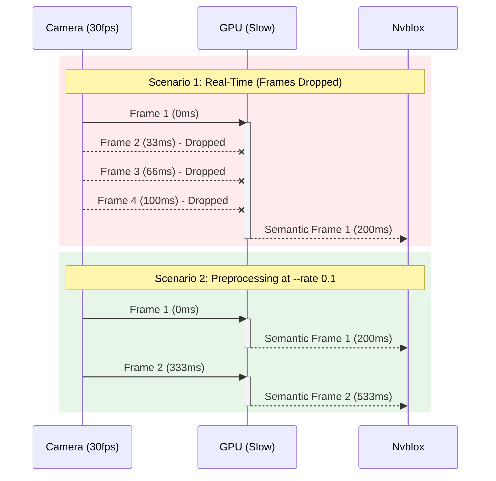

## 1. Introduction & Architecture

### Purpose of the Node
The core of our semantic pipeline is the `dino_node.py` script. It bridges the gap between raw camera sensor data and 3D spatial mapping by adding semantic understanding.

Instead of just mapping *where* an obstacle is (geometry) like it is tradionally done, the pipeline needs to know *what* it is (semantics). To do this, the node takes a raw RGB image and runs it through a two-stage AI pipeline:
1. **GroundingDINO:** Detects objects based on text prompts and generates rough bounding boxes.
2. **Segment Anything Model (SAM):** Takes those bounding boxes and extracts precise, pixel-perfect segmentation masks.

The final result is a labeled image that tells the 3D mapping engine exactly which object occupies which pixel in the 2D camera view.

### Data Flow: Inputs and Outputs
The node essentially acts as a translator between the robot's camera drivers and the Nvblox mapping engine.

**Input Topics:**
* `/head_front_camera/color/image_raw`: The raw RGB image stream from the robot's camera.
* `/head_front_camera/color/camera_info`: The corresponding camera intrinsics required to project the 2D pixels into 3D space.

**Output Topics:**
Once the image is processed by the AI models, the node publishes two distinct semantic topics:
* `/semantic/image_mono8`: A 1-channel grayscale image. Instead of color intensity, each pixel value represents a specific **Class ID** (e.g., `1` for Person, `2` for Chair). This is the mathematical input used by Nvblox for the 3D semantic reconstruction.
* `/semantic/image_rgb8`: A 3-channel color image where each class is painted in its designated RGB color. This topic is not used for mapping, but purely for human-readable visualization (e.g., in RViz or Foxglove) and debugging.



## 2. The AI Models (DINO & SAM)

Our pipeline relies on a dual-model approach to extract meaning from the camera feed. Instead of trying to do everything with one monolithic neural network, we split the job into two specialized steps: detection and segmentation.

### GroundingDINO: Zero-Shot Detection
GroundingDINO handles the first step: finding the objects. 

The biggest advantage here is that GroundingDINO is a "zero-shot" detector. You do not need to train it on a custom dataset, you just need to give it a yaml_configuration_file with the objects it should be able to detect. So you can customize this file depending on the environment you want to use the robot in.

Our `dino_node.py` script automatically reads your `semantic_classes.yaml` file, joins all your class names into a single text string (e.g., `"chair . table . person"`), and feeds it to DINO as a prompt. DINO then scans the image and returns bounding boxes for anything that matches those words.

### Segment Anything (SAM): Pixel-Perfect Masks
Bounding boxes are a beginning, but they are just rectangles. If a person is sitting on a chair, their bounding boxes will heavily overlap, which won't work properly with Nvblox. Nvblox needs to know exactly which pixel belongs to the person and which belongs to the chair.

This is where SAM comes in. We pass DINO's bounding boxes directly to SAM as hints. SAM looks inside each box, separates the foreground object from the background, and outputs a pixel-perfect mask.


*Left: Raw RGB | Middle: GroundingDINO Bounding Boxes | Right: SAM Pixel Masks*

### Model Selection (`model_type`)
Running these models is computationally expensive. To give you control over the tradeoff between speed and quality, the node exposes a `model_type` parameter. 

You can set this in your launch file or via the preprocessing script to choose which SAM backend loads:
* **`mobile` (Default):** Loads MobileSAM (`vit_t`). This is highly optimized and runs significantly faster. It is strongly recommended for development, testing, and machines with less VRAM.
* **`vit_b`:** Loads the standard SAM Base model. This is the sweet spot. It offers a great balance between processing speed and mask quality.
* **`vit_h`:** Loads the SAM Huge model. This is very slow (50 times slower than mobile) and will require you to have a good enough GPU, but it guarantees the highest possible precision for your segmentation masks.

Segmentation settings will need environment specific tuning. A configuration that works perfectly in a brightly lit simulation might fail in a dark, real-world basement.
When tuning your parameters, you must consider:
* Resolution: Higher resolutions yield better masks but demand more computation.
* Lighting and contrast levels: Dark or washed-out images make it significantly harder for DINO to detect object edges.
* Object types, density, and scale: A room cluttered with hundreds of overlapping items requires different thresholds than an empty hallway.

<table>
  <tr>
    <td></td>
    <td></td>
  </tr>
</table>
On the left the environment was perfect for object dection thats why everything was perfectly recognized. While on the right, the parameters weren't optimized.

### Tuning Detection Sensitivity (Thresholds)

While the `semantic_classes.yaml` file tells the pipeline *what* to look for, the threshold parameters tell it *how strict* it should be when looking. 

GroundingDINO relies on confidence thresholds (`box_threshold` and `text_threshold`) to decide whether a visual feature actually matches your text prompt. When you run our `preprocess_semantic_bag.sh` script, you will be interactively prompted to select this value.

Based on our testing, the sweet spot lies between **`0.25`** and **`0.40`**. Your choice depends entirely on your priority for the final 3D map:

* **`0.25` (High Sensitivity / "Full Mesh"):** The AI is very aggressive. It will attempt to label almost every object it sees, resulting in a highly dense, fully colored mesh. 
  * *The trade-off:* It is prone to "hallucinations" (e.g., misclassifying a weirdly shaped shadow on the floor as a backpack).
* **`0.30` (Balanced):** The recommended default. It offers a solid middle ground between catching most objects and avoiding false positives.
* **`0.40` (High Precision / "Strict Mesh"):** The AI acts like a harsh critic. It will only output a mask if it is absolutely certain. 
  * *The trade-off:* You might get a sparser mesh with some unlabeled (uncolored) gaps, but the objects that *are* labeled are guaranteed to actually exist in reality.
* Or anything in between

## 3. Configuration: The `semantic_classes.yaml`

One of the main design goals of this pipeline is flexibility. You should never have to modify the Python source code just to make the robot detect a new object. 

Everything is controlled dynamically through the `semantic_classes.yaml` file.

### File Structure
The configuration file defines the exact classes the AI should look for, along with their mathematical ID and visualization color. 

Here is what a typical entry looks like:

```yaml
semantic_classes:
  person:
    id: 6
    color: [255, 0, 0]     # Red
  chair:
    id: 53
    color: [255, 20, 147]  # Pink
```
When adding new classes, keep these two rules in mind:

* 1. The `id` field: This integer is published to the /semantic/image_mono8 topic. It is crucial that these IDs map correctly to whatever your downstream mapping tool (Nvblox) expects. For example two different objects can't have the same ID.

* 2. The `color` field: This is an RGB array used to paint the /semantic/image_rgb8 topic. It makes debugging in RViz much easier when every object has a distinct, hardcoded color.

### Dynamic Auto-Prompting
You might wonder how GroundingDINO knows what to search for if we only define it in a YAML file.

During initialization, `dino_node.py` parses this YAML file and extracts all the class names (the keys). It then automatically concatenates them using a dot separator (which DINO requires) to build the text prompt.

For example, if your YAML contains `person`, `chair`, and `laptop`, the node generates the prompt `"person . chair . laptop"` on the fly. This ensures that your detection model and your color mappings are never out of sync.

## 4. Core Features & Logic: The Confidence Map

While integrating these AI models, we ran into a massive engineering challenge: overlapping objects. 

### The Flickering Problem
Imagine a camera looking at a "laptop" sitting on a "desk". GroundingDINO detects both. SAM generates a mask for both. Because the laptop is physically inside the desk's bounding box, their pixel masks overlap. 

If we process them naively, the rule is "last one wins". The desk might completely overwrite the laptop just because it was processed a millisecond later in the loop. In a continuous video stream, this causes the objects in the 3D Nvblox mesh to flicker wildly.

### The Solution: Max-Confidence Arbitration
To fix this, we implemented a custom arbitration logic in `dino_node.py`. Instead of blindly overwriting pixels, the script acts like a bouncer. 

We maintain a `confidence_map`—a 2D array that remembers the highest confidence score (the "logit" probability from DINO) for every single pixel in the current frame. When a new mask wants to paint a pixel, it has to beat the current high score.

Here is the actual core logic from the node:

```python
# 'mask' is the boolean array from SAM
# 'score' is the confidence float from DINO (e.g., 0.85)

# 1. Check where the mask is active
# 2. Check where the new score is BETTER than the old score
update_mask = mask & (score > confidence_map)

# Only update the image at these "winning" pixels
if np.any(update_mask):
    semantic_mono8[update_mask] = class_id
    semantic_rgb8[update_mask] = color
    
    # IMPORTANT: Save the new high score to protect this pixel!
    confidence_map[update_mask] = score
```

This simple but effective logic drastically reduces flickering. A highly confident, small object (like a laptop) will punch perfectly through a large, lower-confidence background object (like a desk), regardless of which order they are processed in.

### Timestamp Synchronization
There is one more critical detail: Nvblox uses a strict `TimeSynchronizer` to match our semantic 2D images with the incoming Depth images. If the timestamps are off by even a millisecond, Nvblox drops the frame.

To guarantee perfect alignment, our node meticulously copies the exact ROS header (including the nanosecond `stamp`) from the incoming raw image directly onto our outgoing semantic images.

## 5. Preprocessing & Performance (Best Practices)

Running heavy AI models like GroundingDINO and SAM requires significant GPU resources. This creates a specific timing challenge when building a 3D map with Nvblox.

### The Latency Bottleneck
Typically, a robot's RGB-D camera publishes frames at 30 FPS (one frame every ~33ms). However, running a full DINO + SAM inference pipeline might take around 200ms per frame on a standard laptop GPU. 

If you attempt to run the pipeline in real-time, the ROS 2 message queues will fill up, and the system will start dropping semantic frames to keep up. 
This is a fatal problem for Nvblox: its internal `TimeSynchronizer` requires the depth image and the semantic image to arrive with identically matched timestamps. If the semantic image is dropped, Nvblox cannot integrate that frame, leading to missing data or uncolored "ghost" artifacts in the 3D mesh.

### The "Slow Motion" Solution
To guarantee a perfect 1:1 match between depth frames and semantic masks, we strongly recommend an offline preprocessing step. Instead of running the pipeline live, we process the raw sensor bag in "slow motion" and record a new, perfectly synchronized bag.

We provide a script for this: `preprocess_semantic_bag.sh`.

Under the hood, this script plays the original ROS bag at a drastically reduced playback rate (e.g., 10% speed). This gives the GPU ample time to process every single image without dropping a single frame:



```bash
# Example of what happens inside the script:
ros2 bag play original_bag --clock --rate 0.1
```

Once the script finishes, you will have a new "Semantic Bag" containing the original depth data alongside the fully computed, perfectly synced `/semantic/image_mono8` and `/semantic/image_rgb8 topics`. You can then feed this preprocessed bag into Nvblox at full speed.

Verifying the Preprocessing
After creating your semantic bag, you could always verify that the preprocessing was successful. You can do this by checking the message counts:

```bash
ros2 bag info my_semantic_bag
```

Look at the **`Topic information`. The Count for your depth topic (e.g., **`/head_front_camera/depth/image_rect_raw`) must be virtually identical to the Count for **`/semantic/image_mono8`. If the semantic topic has significantly fewer messages, your GPU was still dropping frames. In that case, you need to lower the playback rate even further (e.g., to 0.05).

## 6. Troubleshooting & Common Issues We Faced During Production

Even with a perfectly configured pipeline, running heavy AI models alongside real-time 3D mapping can lead to edge-case issues. Here are the most common problems and how to fix them.

### Issue 1: CUDA "Out of Memory" (OOM) Errors
**Symptom:** The `dino_node.py` crashes immediately upon startup or randomly during playback with a PyTorch `CUDA out of memory` exception.
**Fix:** - **Switch Models:** You are likely using `vit_h` (SAM Huge) on a GPU with less than 12GB of VRAM. Change the `model_type` parameter to `mobile` (MobileSAM) or `vit_b` (SAM Base).
- **Clear VRAM:** Ensure no other GPU-heavy tasks (like another training script or a heavy Unity scene) are running in the background. Our `preprocess_semantic_bag.sh` script actively attempts to clear lingering memory before starting.

### Issue 2: Mesh is Built, but Colors are Missing (Gray Walls)
**Symptom:** Nvblox successfully reconstructs the 3D geometry of the room, but the semantic colors are missing, spotty, or completely gray.
**Fix:** - **Lower the Playback Rate:** This is a classic `TimeSynchronizer` drop. Your GPU was too slow to generate the semantic masks, so Nvblox only integrated the depth data. You need to re-run your preprocessing script and lower the `--rate` parameter (e.g., from `0.1` down to `0.05`). 
- Verify your bag message counts as described in Section 5.

### Issue 3: Objects Flickering or "Ghosting" in 3D
**Symptom:** A segmented object (like a chair) keeps appearing and disappearing in the final 3D mesh, or leaves a blurry "ghost" trail when the camera moves.
**Fix:** - **Tweak Nvblox:** Open `nvblox_params.yaml` and increase the `mesh_integrator_min_weight` parameter (e.g., to `0.5` or higher). This forces Nvblox to wait for multiple consistent semantic observations of the same object before permanently committing it to the 3D map.
- **Tweak DINO:** Check your `box_threshold` in the DINO configuration. If it is set too low (e.g., `0.1`), DINO might be hallucinating objects that aren't there. Raise it to `0.3` or `0.4` for stricter, more stable detections.